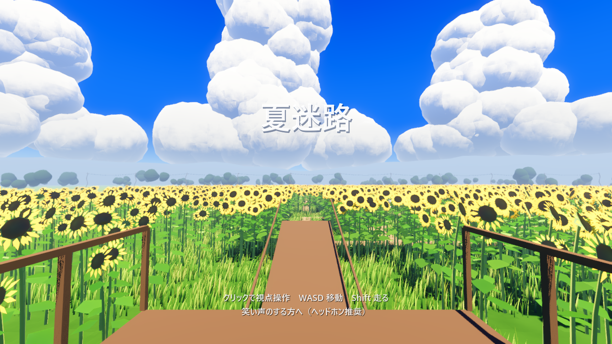
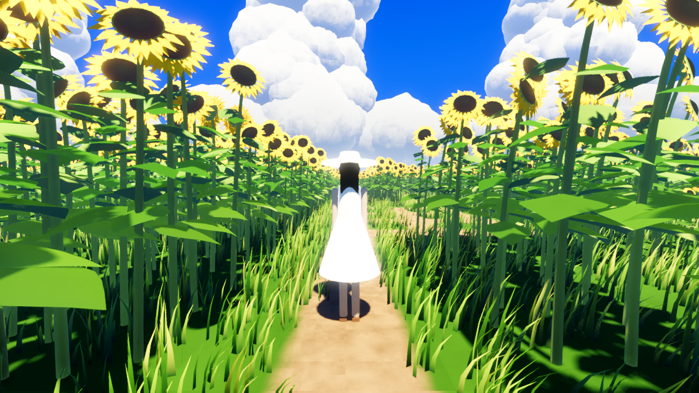
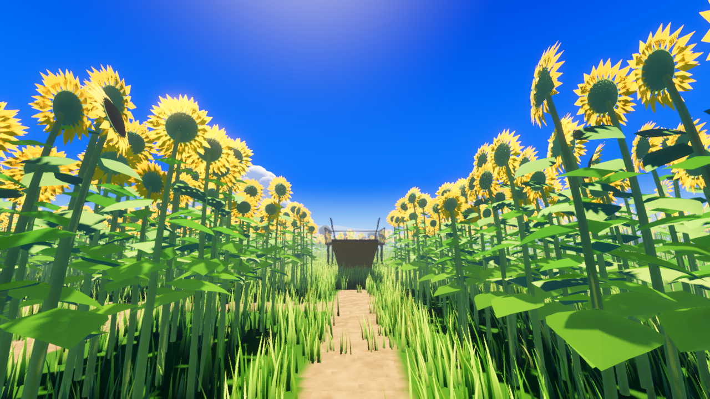

# 夏迷路（Godot版プロトタイプ）

▶ **遊ぶ: https://katomi95.github.io/natu-meiro-godot/**

（PCブラウザ推奨・ヘッドホン推奨。初回は約38MBの読み込みがあります）

「真夏のひまわり迷路」1ステージだけのプロトタイプ。
Web版の[夏迷路](https://github.com/katomi95/natu-meiro)（three.js）と比べて、Godot 4.6 の描画機能でどこまで「夏の空気」を作れるかを試した検証用です。



## 操作

| キー | 動作 |
| --- | --- |
| クリック | 視点操作を開始（Esc で解除） |
| W A S D | 移動 |
| マウス | 視点 |
| Shift | 走る |

笑い声が聞こえる方へ進んでください。

## デスクトップ版とWeb版の違い

- デスクトップ版（Godotエディタで F5）は Forward+ レンダラー。ボリュメトリックフォグ・SSAO が効きます。
- Web版は WebGL2 の都合で Compatibility レンダラーになり、ボリュメトリックフォグと SSAO は無効です。
  代わりに、ひまわりと草の密度を少し下げ、フォグを薄くしています。

| 迷路の中の「君」 | 逆光のひまわり |
| --- | --- |
|  |  |

## 構成

- `scenes/main.tscn` … Sun / WorldEnvironment / Maze / Player / Kimi / 音声ノード
- `scripts/maze.gd` … 迷路生成、ひまわり・草の MultiMesh 配置、当たり判定、見晴らし台、遠景
- `scripts/kimi.gd` … 「君」（白い帽子と白いワンピースの後ろ姿）、逃げる動き、3D の笑い声
- `scripts/clouds.gd` … 入道雲（球を積み上げた MultiMesh）
- `shaders/` … 植物の風揺れ・逆光透過、空、雲、地面、陽炎
- `docs/` … Web書き出し（GitHub Pages 公開用）

## 撮影・テスト用の引数

```
godot --path . -- --shots=<出力フォルダ> --pose="x,y,z,yaw,pitch;..."
godot --path . -- --autowalk      # 正解ルートを自動で歩いてクリアまで確認
```

## クレジット

- 効果音素材: [ポケットサウンド / 効果音素材](https://pocket-se.info/)（「君」の笑い声、蝉の声）
- フォント: Noto Serif JP（SIL Open Font License 1.1、`fonts/OFL.txt`）。使用文字のみにサブセット化
- エンジン: [Godot Engine](https://godotengine.org/) 4.6
