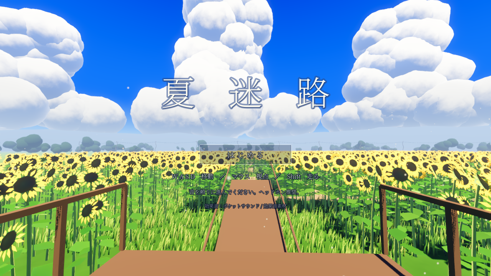
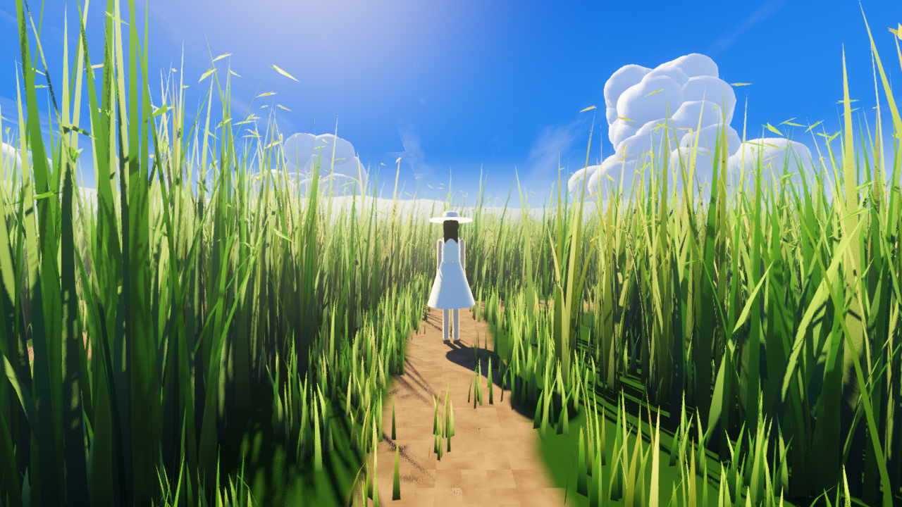
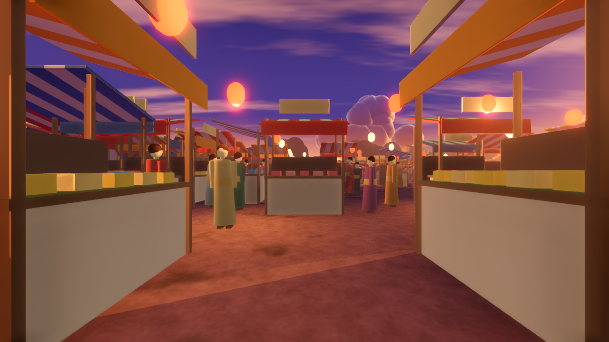
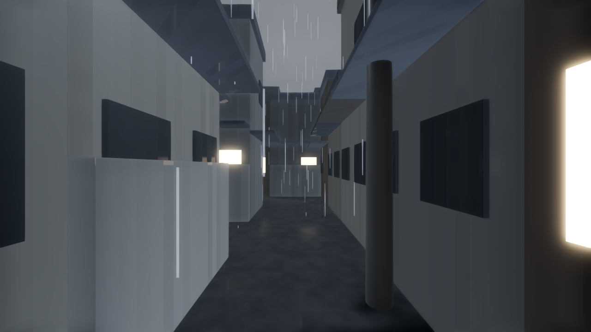
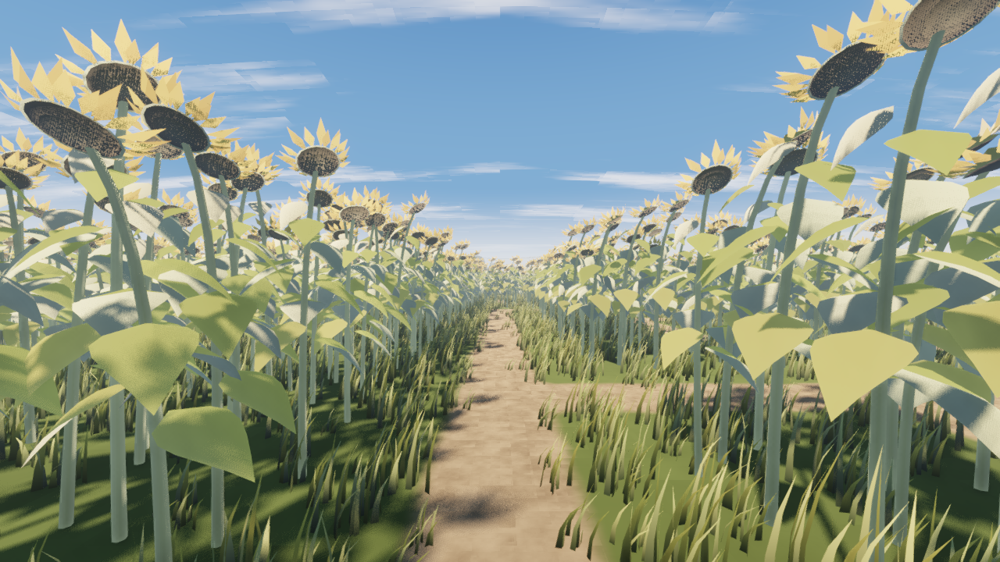

# 夏迷路（Godot版）

▶ **遊ぶ: https://katomi95.github.io/natu-meiro-godot/**

（PCブラウザ推奨・ヘッドホン推奨。初回は約39MBの読み込みがあります）

笑い声を頼りに、ひと夏の迷路を「君」を追って歩く短い3Dゲーム。
Web版の[夏迷路](https://github.com/katomi95/natu-meiro)（three.js）を Godot 4.6 で作り直したものです。



## 操作

| キー | 動作 |
| --- | --- |
| クリック | 視点操作を開始（Esc で解除） |
| W A S D | 移動 |
| マウス | 視点 |
| Shift | 走る |

画面に地図や目印はありません。笑い声が聞こえる方へ進んでください。

## ステージ

| # | ステージ | 内容 |
| --- | --- | --- |
| 1 | ひまわり畑 | 真夏の正午。見晴らし台から背丈より高いひまわりの迷路へ |
| 2 | 夏草 | 背丈を越える夏草。虫の声と風 |
| 3 | 夏祭り | 夕暮れの屋台と提灯、浴衣の人混み、打ち上げ花火。子どもの目線で |
| 4 | 夕立 | 雨の路地。雷。雨が弱まったときだけ声が聞こえる |
| 5 | 夏の終わり | うなだれたひまわり。遠くでヒグラシ。…… |

| 夏草 | 夏祭り |
| --- | --- |
|  |  |
| **夕立** | **夏の終わり** |
|  |  |

## デスクトップ版とWeb版の違い

- デスクトップ版（Godotエディタで F5）は Forward+ レンダラー。ボリュメトリックフォグ・SSAO・SSIL・SSR（雨の水たまりの映り込み）が効きます。
- Web版は WebGL2 の都合で Compatibility レンダラーになり、それらは無効です。
  代わりに植物の密度を下げ、フォグと環境光を調整しています。

## 構成

- `scenes/main.tscn` … Sun / WorldEnvironment / Maze / Player / Kimi / 音声ノード
- `scripts/main.gd` … タイトル・ステージ進行・環境の切り替え・環境音・夕立・最終ステージの演出
- `scripts/stages.gd` … 5ステージの設定（空・光・フォグ・音・迷路の大きさ）
- `scripts/maze.gd` … 迷路生成と、スタイル別の壁（ひまわり / 夏草 / 屋台と人混み / 町並み）
- `scripts/props.gd` … ひまわり・草・屋台・人のメッシュ生成
- `scripts/kimi.gd` … 「君」（白い帽子と白いワンピースの後ろ姿）、歩き・走りのアニメーション、3Dの笑い声
- `scripts/clouds.gd` … 入道雲
- `shaders/` … 植物の風揺れ・逆光透過、空（曇天・巻雲・稲光）、雲、地面、町、人混み、陽炎
- `tools/gen_audio.py` … 雨・雷・風・ざわめき・足音・ヒグラシ・最後の蝉などを合成して `audio/synth/` に書き出す
- `docs/` … Web書き出し（GitHub Pages 公開用）

## テスト用の引数

```
godot --path . -- --stage=2                         # ステージ3から
godot --path . -- --autowalk --fast                  # 正解ルートを自動で歩き、エンディングまで確認
godot --path . -- --stage=1 --shots=<dir> --pose=start   # 撮影
```

## クレジット

- 効果音素材: [ポケットサウンド / 効果音素材](https://pocket-se.info/)（「君」の笑い声、蝉の声、ヒグラシ、祭囃子、花火の破裂音）
- その他の環境音は `tools/gen_audio.py` によるプログラム合成
- フォント: Noto Serif JP（SIL Open Font License 1.1、`fonts/OFL.txt`）。使用文字のみにサブセット化
- エンジン: [Godot Engine](https://godotengine.org/) 4.6
